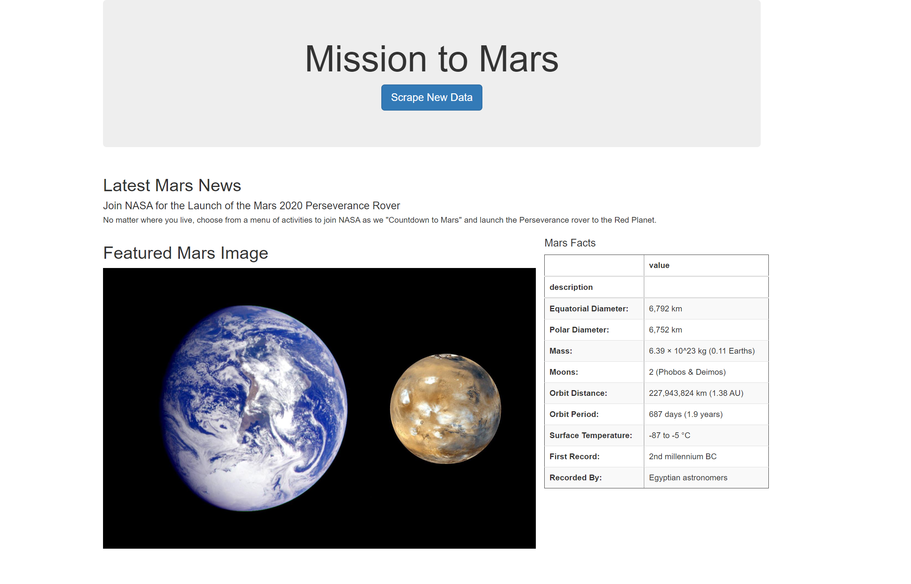
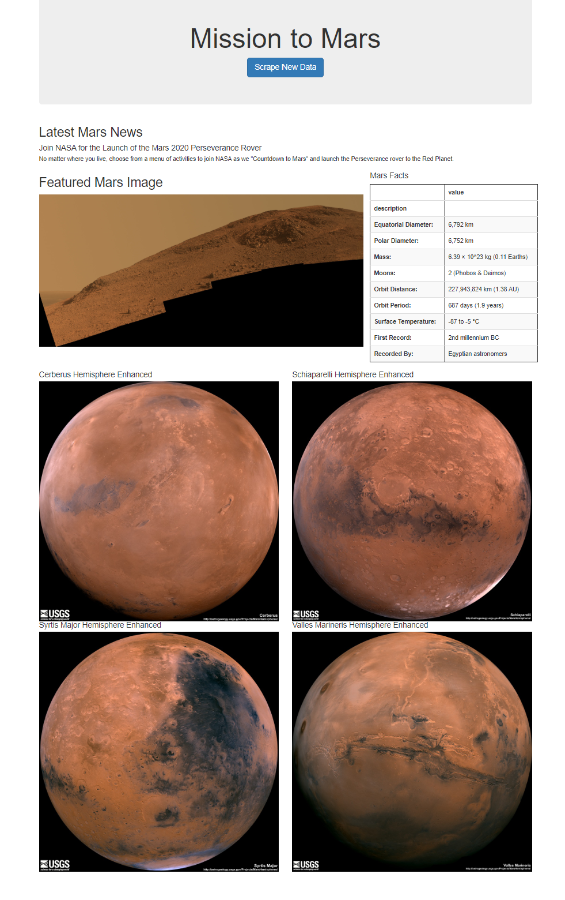

# Mission-to-Mars

##A. Background

1. Use BeautifulSoup and Splinter to automate a web browser and scrape high-resolution images.
2. Use a MongoDB database to store data from the web scrape.
3. Update the web application and Flask to display the data from the web scrape.
4. Use Bootstrap to style the web app.

##B. Results

##D. Recommendation

1) align the images in the index.html
